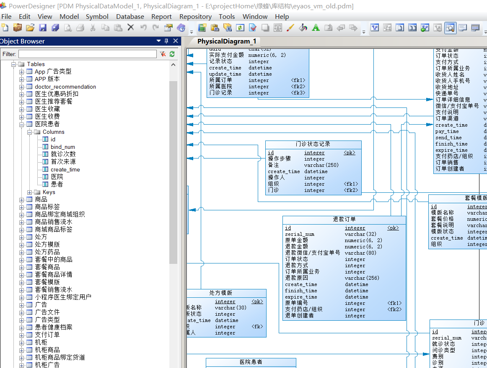

# django_sqltools
根据model生成sql，或者根据sql生成model

# 安装
pip install git+https://github.com/yang0/django_sqltools

# 使用
1 给项目指定一个新的测试数据库  
2 清理所有migration目录  
3 安装app: django_sqltools  
4 mysql engine指定为：django_sqltools.mysql  
5 运行 python manange.py allmigrations   
6 运行 python manage.py makesql  

# 导入power design
上一步运行结束后会生成dump.sql  
以下操作在power designer里面运行  
1 导入  
   file-> reverse engineer-->database，接着一步步导入sql  
  
2 将comment字段转换成name  
   tools-> excute commands， 把本项目目录powerdesigner下的vb脚本导入后运行，大功告成

效果如下：  

